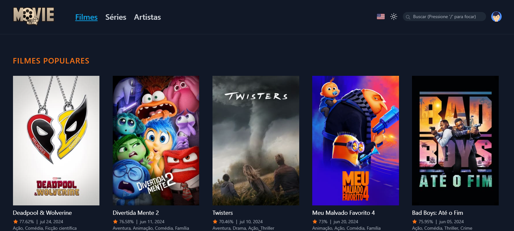

<h1 align="center">
  🎥 Site de Filmes, Séries e Artistas
</h1>

<p align="center">
  
  
  
  
  
  
  
  
  
  
  
</p>

<p align="center">
  <a href="#-tecnologias">Tecnologias</a>&nbsp;&nbsp;&nbsp;|&nbsp;&nbsp;&nbsp;
  <a href="#-projeto">Projeto</a>&nbsp;&nbsp;&nbsp;|&nbsp;&nbsp;&nbsp;
  <a href="#-funcionalidades">Funcionalidades</a>&nbsp;&nbsp;&nbsp;|&nbsp;&nbsp;&nbsp;
  <a href="#-requisitos">Requisitos</a>&nbsp;&nbsp;&nbsp;|&nbsp;&nbsp;&nbsp;
  <a href="#-tmdb">TMDB</a>&nbsp;&nbsp;&nbsp;|&nbsp;&nbsp;&nbsp;
  <a href="#-instalacao">Instalação</a>&nbsp;&nbsp;&nbsp;|&nbsp;&nbsp;&nbsp;
  <a href="#-miscelaneas">Miscelâneas</a>&nbsp;&nbsp;&nbsp;|&nbsp;&nbsp;&nbsp;


</p>

<br>

<div align="center">
  <a href="https://movies-show-site.netlify.app/" style="font-size: 1.2rem">Clique aqui para acessar o projeto online</a>
</div>

<br>

<div align="center">
  
</div>

## 💥 Tecnologias

Este projeto foi desenvolvido com as seguintes tecnologias:

- [HTML5](https://html5.org/)
- [CSS3](https://www.w3.org/Style/CSS/Overview.en.html)
- [JavaScript](https://www.javascript.com/)
- [TypeScript](https://www.typescriptlang.org/)
- [UnoCSS](https://unocss.dev/)
- [Google Fonts](https://fonts.google.com/)
- [Pnpm](https://pnpm.io/)
- [ESLint](https://eslint.org/)
- [Commitlint](https://commitlint.js.org/)
- [Lintstage](https://github.com/lint-staged/lint-staged)
- [Vite](https://vitejs.dev/)
- [Vue.js](https://vuejs.org/)
- [Vue Router](https://router.vuejs.org)
- [Vue I18n](https://vue-i18n.intlify.dev/)
- [VueUse](https://vueuse.org/)
- [Vitest](https://vitest.dev/)
- [Vue Test Utils](https://test-utils.vuejs.org/)
- [Nock](https://github.com/nock/nock)
- [Playwright](https://playwright.dev/)
- [Lefthook](https://github.com/evilmartians/lefthook)
- [Moment.js](https://momentjs.com/docs/)
- [Notivue](https://docs.notivue.smastrom.io/)
- [Git](https://git-scm.com/)
- [GitHub](https://github.com/)
- [GitHub Actions](https://docs.github.com/en/actions)

## 💻 Projeto

Este projeto é um site para exibição dos filmes, séries e atores mais populares mundialmente. Desenvolvido como um projeto pessoal, ele visa praticar minhas habilidades em desenvolvimento frontend com Vue.js, incluindo design responsivo e cobertura completa de testes unitários e e2e.

## ✅ Funcionalidades

- **Tour Interativo**: Apresenta as principais funcionalidades do site ao usuário de forma guiada e didática.
- **Menu de Filmes**: Exibe os 20 filmes mais populares e os 20 filmes em cartaz atualmente, com base nas avaliações do IMDB. Inclui tela de detalhes com trailer, elenco e imagens do filme.
- **Menu de Séries**: Exibe as 20 séries mais populares e as 20 séries em exibição, com base nas avaliações do IMDB. Inclui tela de detalhes com trailer, elenco e imagens da série.
- **Menu de Artistas**: Exibe os 20 artistas mais populares, com scroll infinito para carregar mais artistas. Inclui tela de detalhes com informações e créditos dos artistas.
- **Troca de Idioma**: O site suporta troca de idioma entre português e inglês.
- **Troca de Tema**: Alterna entre tema claro e escuro.
- **Busca Avançada**: Permite procurar filmes, séries ou artistas por nome, com sugestões exibidas a partir de 3 caracteres.
- **Design Responsivo**: Layout 100% responsivo, adaptado para diferentes dispositivos.

## 📄 Requisitos

- **Navegador**: Versão mais recente do Chrome, Firefox, Edge, Safari, Opera, ou outro navegador moderno.
- **Pnpm**: Gerenciador de pacotes [Pnpm](https://pnpm.io/).
- **API Read Access Token**: Chave de acesso da API do TMDB.

## 🎬 Cadastro no TMDB e Obtenção da Chave API

1. Cadastre-se no [TMDB](https://www.themoviedb.org/signup).
2. Verifique seu e-mail e acesse a página [API Settings](https://www.themoviedb.org/settings/api) para obter a chave **API Read Access Token**.

## ⚙️ Instalação e Execução

### Passos para Instalação

1. **Clone o repositório ou baixe o arquivo ZIP**:
    ```sh
    git clone https://github.com/randercarlos/movie-app.git
    ```

2. **Navegue até a pasta do projeto**:
    ```sh
    cd movie-app
    ```

3. **Instale as dependências**:
    ```sh
    pnpm install
    ```

4. **Configure a chave da API**:
   - No arquivo `.env`, insira a chave `VITE_TMDB_TOKEN` sem aspas:
     ```env
     VITE_TMDB_TOKEN=[sua-api-key-do-TMDB]
     ```

5. **Execute o servidor**:
    ```sh
    pnpm run dev
    ```

6. **Acesse o site**: Abra [http://localhost:5173/](http://localhost:5173/) no seu navegador.


## 🎨 Miscelâneas

### Checagem de código com ESLint

1. **Checa erros de código sem corrigi-lo**:
    ```sh
    pnpm run lint:check
    ```

2. **Checa erros de código com correção**:
    ```sh
    pnpm run lint:fix
    ```

### Comandos para build do código

1. **Checa erros de tipagem do código**:
    ```sh
    pnpm run type-check
    ```

2. **Realiza o build do projeto para produção**:
    ```sh
    pnpm run build

3. **Preview do projeto em ambiente de produção no ambiente local**:
    ```sh
    pnpm run preview
    ```

4. **Roda o commintlint para fazer commit semântico**:
    ```sh
    pnpm run commitlint
    ```

### Comandos para testes unitários e e2e do código

1. **Roda testes unitários e e2e no terminal em modo verboso**:
    ```sh
    pnpm run test
    ```

2. **Roda testes unitários e e2e no terminal para CI/CD**:
    ```sh
    pnpm run test:ci
    ```

3. **Roda testes unitários terminal em modo verboso**:
    ```sh
    pnpm run test:unit
    ```

4. **Roda testes unitários com cobertura de código no browser**:
    ```sh
    pnpm run test:unit:ui
    ```

5. **Roda testes unitários no terminal para CI/CD**:
    ```sh
    pnpm run test:unit:ci
    ```

6. **Roda testes unitários com cobertura de código no terminal**:
    ```sh
    pnpm run test:unit:coverage
    ```

7. **Roda testes e2e no terminal em modo verboso**:
    ```sh
    pnpm run test:e2e
    ```

8. **Roda testes e2e no browser**:
    ```sh
    pnpm run test:e2e:browser
    ```

9. **Roda testes e2e na interface gráfica do playwright(debug, locator, logs...)**:
    ```sh
    pnpm run test:e2e:ui
    ```

10. **Roda testes e2e no terminal para CI/CD**:
    ```sh
    pnpm run test:e2e:ci
    ```

11. **Roda somente testes e2e que falharam no terminal**:
    ```sh
    pnpm run test:e2e:failed
    ```

12. **Roda testes e2e em modo debug**:
    ```sh
    pnpm run test:e2e:debug
    ```

13. **Roda o gerador de testes e2e**:
    ```sh
    pnpm run test:e2e:codegen
    ```

14. **Mostra o relatório de testes e2e executados**:
    ```sh
    pnpm run test:e2e:report
    ```

## 📄 Documentações

### Log de mudanças

Esse projeto tem um arquivo de [CHANGELOG.md](CHANGELOG.md) contendo o histórico de commits com
todas as alterações realizadas no projeto.

### Padronização de Commits
Esse projeto usa o **conventional commits** que é uma padronização para os commits com o objetivo
de organizar melhor as alterações feitas. Para mais detalhes, consultar o arquivo [COMMITS.md](COMMITS.md)

### Como contribuir
Para saber como contribuir com esse projeto sendo um desenvolvedor, consulte o arquivo [CONTRIBUTING.md](CONTRIBUTING.md)

---

Desenvolvido por [Rander Carlos](https://www.linkedin.com/in/rander-carlos) 👋 [randerccf@gmail.com](mailto:randerccf@gmail.com)
